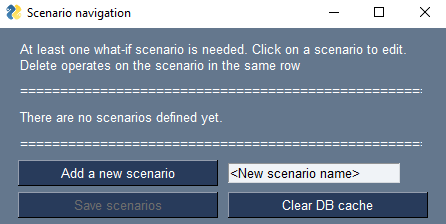
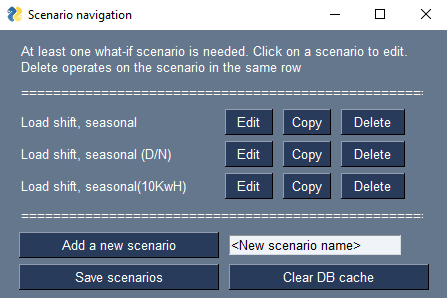
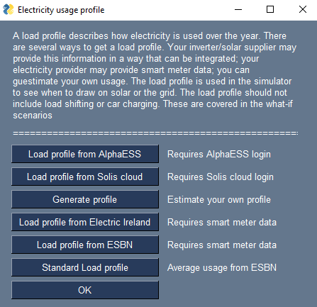
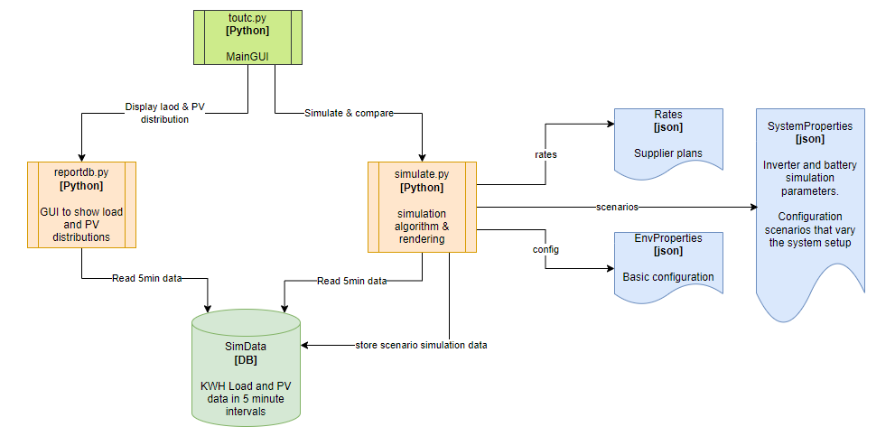

# tout-compare
App that compares time of use tariffs for electricity with solar, inverter and battery options.

This is a work in progress. Be nice! It is useful now.

I started this after installing solar panels, and getting a 'smart meter'. The smart meter opened up the wonderful world of, Time of Use Tariffs (TOUT). I was unable to find a comparison tool that took into account individual electricity usage, never mind the added complexity of solar panels, inverter, battery and getting paid for excess electricity generation (Feed-in tariff). 

It's now at a point where it can be useful to those:
* Thinking about getting set up for solar generation
* Thinking about adding to an existing solar generation installation
* Who have a smart meter and want to compare the different supplier options
* Wondering about how charging an electric car at home will impact the bill

There is some setup involved as the data must reflect your electricity usage for the cost generation/comparison to be meaningful. Getting started is easy enough, just begin at the top and work your way down. Defaults are provided for everything except rates. These change too quickly to be included here. You can find a 'rates.json' in the git repo. It includes the date each rate was added, and the source of the information. It can be imported by the rate editor.

# Installation

## If you have python
Just clone the repo, install the modules in requirements.txt and run the toutc.py script

## Using the installer
Download the installer, install and execute toutc.exe
You can find the download as an asset in the Releases area https://github.com/Tonyslogic/tout-compare/releases

This one may need the MS VC++ redistributable...

# Usage
On first launch only configuration options and exit are enabled.

The basic configuration is used to pick a storage locations. If the folders do not exist, the basic configuration cannot be saved. This must be done first.

At this point, there is no other configuration. There are two options:
* Use demo data for a quick start (Click the 'Add Demo Data' button). You can then explore the rest of the configuration and try out the simulate directly.

* Create your own configuration from scratch -- keep reading

The system configuration is populated with some defaults that describe a basic battery (5.7KWH) and inverter (5.0 KW) setup. Modify these if you have your own solar data. Update saves a configuration file that is used elsewhere.

Scenarios add 'what-if' to the simulation. What if the panel count is doubled? What if the battery is used for load shifting? What if I charge a car?

Adding will update the list

Then you must edit by clicking on the named button (or delete). 

The load shifting and car charging are found here. They both work in similar ways. You need to specify when the action happens as well as the bounds of what happens. 

The usage profile is used to capture how electricity load varies over the year. There are several ways to source this data. If you have an inverter, you may be able to download the data directly (AlphaESS is integrated). If you have a smart meter, you can get the data from your supplier (Electric Ireland smart meter datafile is done). If you have neither, you can generate a load profile (if you have a rough idea when you use electricity) or use the "Standard Load Profile" mandated by the CRU for smart meter SST comparison sites.

Generating a profile requires some basic annual and base load data

It also requires how that load is distributed by calendar month, day of week, and hour of day. The three screens are very similar. Use the sliders to specify relative usage -- accuracy is not critical. The basic idea is to capture seasonal, weekly and daily patterns (we are creatures of habit). This is used to generate the 5 minute interval data required by the simulator. It works surprisingly well. Note all three distributions are required (must be saved) before generating data is enabled.

At this point the database contains load data (or if you used the AplhaESS integration, load and PV data). The main window will have been updated to reflect the status as you progress.

At this point viewing the load distribution is possible (Show load graphs). It is not possible to simulate yet as we don't have any pricing or provider rates. These are not includes as they will quickly go out of date. Thankfully the rates editor is provided.

If follows the same use pattern as for scenarios, load shifting, and car charging. Provide a name for the scenario, add and then edit.

There are a couple of things to note when editing the rates:

* The day range must start with 0 and end with 24
* Only whole hours (integers) are accepted, 24Hr clock.
* Each range must start at the end of the previous
* Adjacent ranges with the same cost will be merged
* When adding a new range you must start with the previous, and follow the steps below

Once saved, the simulation option is available. Before going there you can also add some default PV generation. To do this, use the 'Solar data' button. Right now there are two options. Loading the default will load the same solar data that is in the demo data. It automatically aligns day by day with the load profile data.

If you are feeling a little more brave, you can 'Load solar data from PV GIS'. This asks for details about your (planned) solar configuration, then fetches data from a fantastic eruopean resource/tool: https://re.jrc.ec.europa.eu/pvg_tools/en/. Once again it aligns the data with the dates already in the database.

You will need you latitude and logditude. Google maps is you friend here. On windows, drop a pin on a nearby blank area and look in the search bar or on Android, drop a pin on a nearby blank area and the coordinates appear at the top.
The slope refers to the roof slope -- it makes a difference. I used an angle meter on my phone.
The azimuth refers to the direction the panels will face 0=North, 90=East, 180=South. If you are west facing you need to use negative values, -90=West, etc.
Panels ane Wp speak for themselves.
You can add up to two strings here. If your inverter has two inputs, check 'Dedicated MPPT' so the strings are added together (as opposed to picking the best for any given 5 minute interval)

Simulating is as simple as pressing the 'Simulate' button, providing a start date and length (from within the available data). 

This will after a short while render a sortable table where the costs (of each supplier/plan) for each scenario is visible. Note the simulator does not calculate a tax liability, and it is only as good as the input data.

If you saved simulation data (the default) then you can visualise the results for each scenario:

The 'Load profile & PV data graphs' show electricity usage (by hour, day and month) and PV generation by month

Selecting a saved simulation from the drop-down and clicking on 'Simulation results graphs' provides insights on when electricity is bought and sold. It also renders a graph that shows how generated electricity was distributed (to Electric Vehicle, Hot water, Battery, Export to grid, and Household load) by calendar month.

# Design and dependencies
The design is logically split into two: Data population and data processing.

In both cases, the entrypoint is toutc.py. The principle dependencies are shown in the diagrams below.

## Data population

## Data processing

## DB Schema
The database schema is very simple. There are only two tables. Each row in 'dailystats' describes a 5 minute interval. Each row of 'daylysums', represents the totals for a single day.

| Table      | Column      | Type | Description |
| ---------- | ----------- | ---- | ----------- |
| dailystats | Date        | TEXT | YYYY-MM-DD  |
| dailystats | _min        | TEXT | hh:mm       |
| dailystats | NormalLoad  | REAL | 5 minutes usage load (kWh)      |
| dailystats | NormalPV    | REAL | 5 minutes PV generation (kWh) |
| dailystats | MinuteOfDay | REAL | 0-1440      |
| dailystats | DayOfWeek   | REAL | 0-6 (Sun -Sat)      |
| dailysums  | Date        | TEXT | YYYY-MM-DD  |
| dailysums  | PV          | REAL | Daily PV generation (kWh)  |
| dailysums  | Load        | REAL | Daily usage load (kWh)  |

The combination of 'Date' and '_min' in dailystats must be unique. 

### Saved simulation data

# Reward & recognition

If you like this, or better yet, it saves you some money please consider Starring the repository. If you are feeling generous, consider donating to a charity of you choice. My choice is https://joinourboys.org/