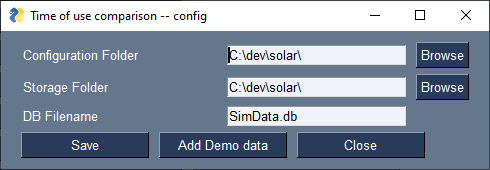
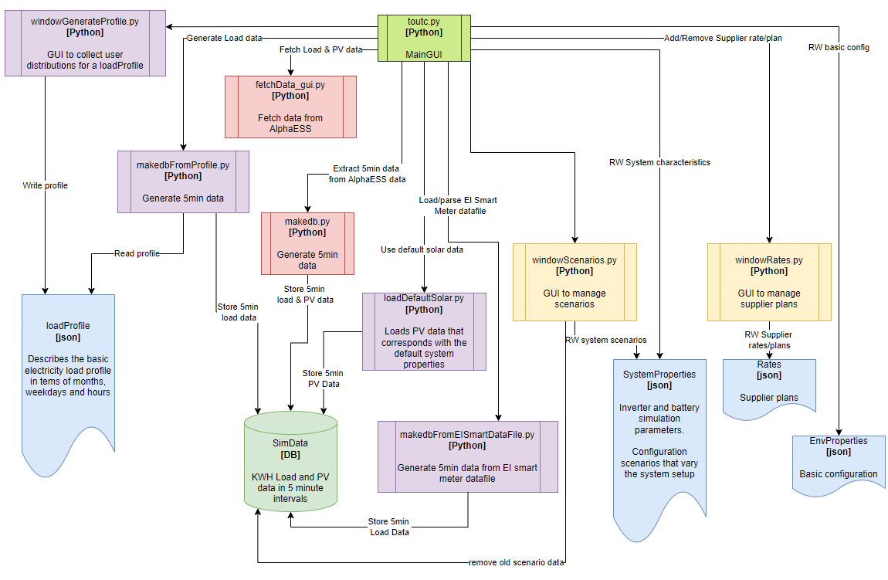

# tout-compare
App that compares time of use tariffs for electricity with solar, inverter and battery options.

This is a work in progress. Be nice! It is useful now.

# Installation

## If you have python
Just clone the repo and run the toutc.py script

## Using the installer
Download the installer and execute toutc.exe

This one may need the MS VC++ redistributable...

# Usage
On first launch only configuration options and exit are enabled.

The basic configuration is used to pick a storage locations. If the folders do not exist, the basic configuration cannot be saved. This must be done first.

Of course, at this stage there is no other configurtion, so working down from the top.

The system configuration is populated with some defaults that describe a basic battery (5.7KWH) and inverter (5.0 KW) setup. Modify these if you have your own solar data. Update saves a configuration file that is used elsewhere.

Scenarios add 'what-if' to the simulation. What if the panel count is doubled? What if the battery is used for load shifting? What if I charge a car?

Adding will update the list

Then you must edit by clicking on the named button (or delete). 

The load shifting and car charging ar found here. They both work in similar ways. You need to specify when the action happens as well as the bounds of what happens. 

The usage profile is used to capture how electricity load varies over the year. There are several ways to source this data. If you have an inverter, you may be able to download the data directly (AlphaESS is integrated). If you have a smart meter, you can get the data from your supplier (to be done). If you have neither, you can generate a load profile.

Generating a profile requires some basic annual and base load data

It also requires how that load is distributed by calendar month, day of week, and hour of day. The three screens are very similar. Use the sliders to specify relative usage -- accuracy is not critical. The basic idea is to capture seasonal, weekly and daily patters (we are creatures of habit). This is used to generate the 5 minute interval data required by the simulator. It works surprisingly well. Note all three distributions are required (must be saved) before generating data is enabled.

At this point the database contains load data (or if you used the AplhaESS integration, load and PV data). The main window will have been updated to reflec the status as you progress.

At this point viewing the load distribution is possible (Show load graphs). It is not possible to simulate yet as we don't have any pricing or provider rates. These are not includes as they will quickly go out of date. Thankfully the rates editor is provided.

If follows the same use pattern as for scenarios, load shifting, and car charging. Provide a name for the scenario, add and then edit.
* Small bug workaround: Update & close after specifying the basic details at the top, otherwise they get dropped when adding new rate ranges.

Once saved, the simulation option is avaialble. Before going there you can also add some default PV generation. To do this, use the 'Solar data' button. Right now there is only one option. In future, it should be possible to use other sources such as https://re.jrc.ec.europa.eu/pvg_tools/en/

Simulating is as simple as pressing the 'Simulate' button, providing a start date and length (from within the avaialble data). 

This will after a short while render a sortable table where the costs (of each supplier/plan) for each scenario is visible. Note the simulator does not calculate a tax liability, and it is only as good as the input data.

# Design and dependencies

